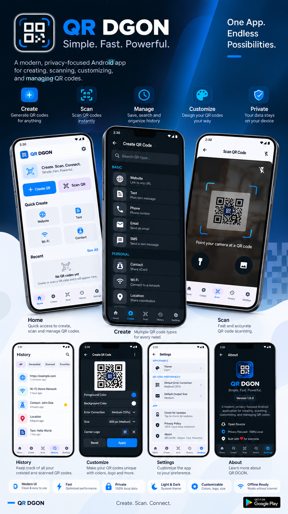
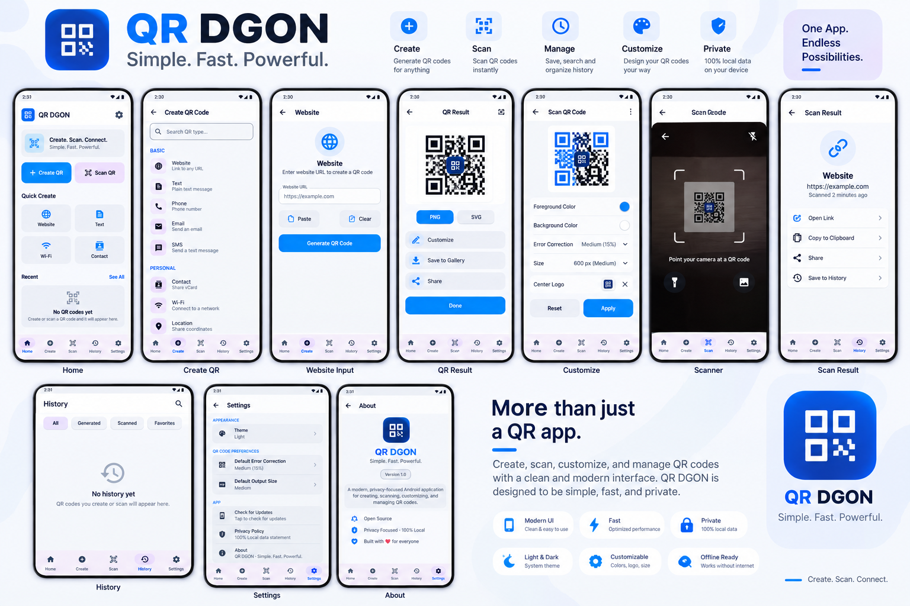

# QR DGON

  

<h2 align="center">Simple. Fast. Powerful.</h2>

  A modern Android QR Code Generator & Scanner

  Create • Scan • Customize • Save • Share

---

## 📱 About QR DGON

**QR DGON** is a modern, clean, and privacy-focused Android application designed to make working with QR codes simple and convenient.

Create QR codes for websites, text, Wi-Fi networks, phone numbers, email addresses, SMS messages, contacts, locations, calendar events, WhatsApp, Telegram, social links, and supported payment formats.

You can customize your QR codes, add a center logo, save them to your history, mark important codes as favorites, export them as PNG images, and share them directly from your device.

QR DGON also includes a fast camera-based QR scanner for quickly reading QR codes and keeping scanned results organized.

---

# ✨ Features

## 🔲 QR Code Generator

Create QR codes for many different types of information:

| Type | Description |
|------|-------------|
| 🌐 Website / URL | Create QR codes for websites and links |
| 📝 Text | Convert any text into a QR code |
| 📶 Wi-Fi | Share Wi-Fi network information |
| 📞 Phone | Create QR codes for phone numbers |
| ✉️ Email | Share email information |
| 💬 SMS | Create predefined SMS QR codes |
| 👤 Contact / vCard | Share contact information |
| 📍 Location | Share geographic locations |
| 📅 Calendar Event | Share event information |
| 🟢 WhatsApp | Create supported WhatsApp links |
| ✈️ Telegram | Create supported Telegram links |
| 🔗 Social Links | Share supported social profiles |
| 💳 Payment | Create supported payment QR formats |

---

# 📷 QR Code Scanner

Scan QR codes quickly using your device camera.

### Scanner features

- ⚡ Fast QR detection
- 📷 Full-screen camera scanner
- 🎯 Clear scanning frame
- 🔦 Flashlight support
- 🔐 Camera permission requested only when scanning
- 📋 Automatic scan result handling
- 🛡️ Safe handling of detected information
- 💾 Scanned QR codes can be saved to history

---

# 🎨 QR Customization

Create QR codes that match your style.

### Customization options

- 🎨 Foreground color
- 🖼️ Background color
- 📐 QR size
- 🛡️ Error correction
- 🖼️ Center logo
- 👀 Live preview
- ⚠️ Contrast checking
- 🔄 Reset customization

### QR Sizes

- **Small** — 300 × 300 px
- **Medium** — 600 × 600 px
- **Large** — 1000 × 1000 px

### Error Correction

Choose from:

- **L**
- **M**
- **Q**
- **H**

Add your own logo using Android's Photo Picker and create personalized QR codes for personal or professional use.

QR DGON also checks color contrast to help maintain QR readability.

---

# 💾 History

Keep your QR activity organized in one place.

QR DGON can store both:

- 🔲 Created QR codes
- 📷 Scanned QR codes

### History tools

- 🔍 Search
- 🔲 Filter
- ⭐ Favorites
- 🗑️ Delete individual records
- 🧹 Clear history
- 🕘 Recent QR activity

Your most recent QR codes can also be accessed directly from the Home screen.

---

# ⭐ Favorites

Save important QR codes as favorites for quick access.

Favorites can be useful for frequently used:

- 📶 Wi-Fi QR codes
- 🌐 Websites
- 👤 Contacts
- 💳 Payment information
- 💼 Business links
- 🔗 Social profiles

---

# 📤 Export & Share

Export your QR codes as PNG images and share them using Android's standard sharing system.

Use exported QR codes for:

- 💼 Business cards
- 🪧 Posters
- 📄 Documents
- 🖥️ Presentations
- 📱 Social media
- 🌐 Websites
- 🖨️ Printed materials

QR DGON makes it easy to create a QR code, customize it, save it, export it, and share it directly from your device.

---

# 🌙 Themes

QR DGON supports multiple appearance modes:

- ☀️ **Light**
- 🌙 **Dark**
- ⚙️ **System Default**

Your selected theme is saved for future use.

---

# 🔒 Privacy

QR DGON is designed with privacy in mind.

Your QR history and application preferences are stored locally on your device.

The core QR generation, customization, and history features do not require an account.

Camera permission is requested only when you use the QR scanner.

---

# 🖼️ Screenshots

  
  

---

# 🚀 Download

Download the latest version of **QR DGON** from the **Releases** section.

### Google Play

Coming soon.

---

# 📋 App Information

| Information | Details |
|------------|---------|
| 📱 App Name | QR DGON |
| 🏷️ Version | 1.0.0 |
| 🤖 Minimum Android | Android 8.0 (API 26) |
| 📲 Target Android | Android 16 (API 36) |
| 🔐 Account | Not required |
| 📷 Camera | Required for QR scanning |
| 💾 History | Stored locally on the device |

---

# ❤️ QR DGON

**Simple. Fast. Powerful.**

Create QR codes.  
Scan QR codes.  
Customize them.  
Save what matters.  
Share them anywhere.

  <strong>QR DGON</strong>

  Made for simple and powerful QR code management.

